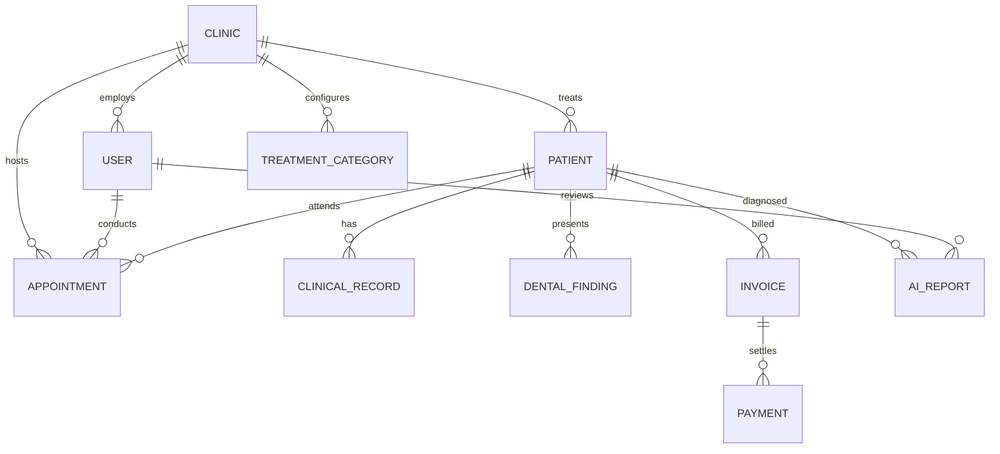

# Dwarka Dental Clinic — Comprehensive System Documentation

> **Complete Technical Architecture, Database Schemas, REST API Reference, Frontend Guide & Deployment Manual**  
> *Version:* 1.0.0 (Production-Ready)  
> *Stack:* MERN (MongoDB Atlas, Express.js 5, React 19, Node.js) + Vite + Redux Toolkit + FastAPI (AI/ML)

---

## 📑 Table of Contents

1. [Project Overview & System Vision](#1-project-overview--system-vision)
2. [Technology Stack Matrix](#2-technology-stack-matrix)
3. [System Architecture & Design Patterns](#3-system-architecture--design-patterns)
4. [Repository & Directory Structure](#4-repository--directory-structure)
5. [Database Design & Mongoose Schemas](#5-database-design--mongoose-schemas)
6. [Complete REST API Reference](#6-complete-rest-api-reference)
7. [Frontend Architecture & State Management](#7-frontend-architecture--state-management)
8. [Interactive Clinical Components & UI Modules](#8-interactive-clinical-components--ui-modules)
9. [Role-Specific Features & Workflows](#9-role-specific-features--workflows)
10. [Specialized Smart Modules](#10-specialized-smart-modules)
11. [Installation, Configuration & Local Development](#11-installation-configuration--local-development)
12. [Default Credentials & Seed Data](#12-default-credentials--seed-data)
13. [Production Deployment & Security Guidelines](#13-production-deployment--security-guidelines)

---

## 1. Project Overview & System Vision

**Dwarka Dental Clinic Management System** is an enterprise-grade, end-to-end clinical and administrative web application tailored specifically for modern dental practices. Built to replace fragmented paper charts, manual scheduling, and disconnected billing tools, it unifies all clinical encounters, patient communications, imaging diagnostics, and financial management into a single responsive platform.

### Core Problem Solved
- **Appointment Bottlenecks**: Prevents overlapping slots and optimizes chair time with intelligent duration calculations based on dental procedure types (e.g., 60 min for RCT, 90 min for Implants).
- **Clinical Records Fragmentation**: Replaces paper charts with digital FDI two-digit dental charts, tooth surface conditions (mesial, distal, occlusal, buccal, lingual), and structured visit diagnoses.
- **Diagnostic Efficiency**: Integrates an AI-assisted X-ray diagnostic pipeline that screens radiographs for cavities and pathologies, generating confidence scores and automated suggestions for doctor verification.
- **No-Show Reduction**: Features one-click and automated WhatsApp notification reminders dispatched directly to patient phone numbers via Twilio.
- **Role Isolation**: Provides secure, role-based dashboards tailored for **Admins**, **Doctors**, and **Receptionists**.

---

## 2. Technology Stack Matrix

| Layer | Technology | Version | Purpose / Highlights |
| :--- | :--- | :--- | :--- |
| **Frontend Framework** | **React** | `v19.2.8` | Next-gen React core with modern hooks and fast rendering |
| **Bundler & Tooling** | **Vite** | `v8.2.0` | Ultra-fast HMR and optimized production bundling |
| **Routing** | **React Router DOM** | `v7.18.2` / `v8` | Declarative routing with nested layouts and route guards |
| **State Management** | **Redux Toolkit & RTK Query**| `v2.12.0` | Centralized caching, automated tag invalidation, and UI slices |
| **Styling** | **Tailwind CSS** | `v4.3.3` | Modern utility-first CSS engine with custom design tokens |
| **Data Visualization** | **Recharts** | `v3.10.1` | Analytics charts for revenue, appointment trends, and category distribution |
| **Icons** | **Lucide React** | `v1.31.0` | Crisp, modern medical and administrative icon set |
| **Backend Runtime** | **Node.js** | `v18+` / `v20` | High-throughput asynchronous JavaScript runtime |
| **Backend Framework** | **Express.js** | `v5.2.1` | Modern Express 5 engine with native async error routing |
| **Database** | **MongoDB / Atlas** | `v7.5+` | NoSQL document store with ACID multi-document transactions |
| **ODM** | **Mongoose** | `v9.9.3` | Strongly-typed schema modeling, hooks, and index definitions |
| **Authentication** | **JWT & Bcrypt.js** | `v9.0` / `v3.0` | Stateless token authentication with salted password hashing |
| **File Handling** | **Multer** | `v2.2.0` | Multipart streaming for X-ray radiographs and documents |
| **External Messaging** | **Twilio SDK** | `v6.1.0` | Automated WhatsApp appointment alerts and reminder delivery |
| **AI / ML Service** | **FastAPI / PyTorch** | Microservice | Python REST microservice for deep-learning radiograph inference |

---

## 3. System Architecture & Design Patterns

### Architectural Overview

The backend follows an enterprise **Controller-Service-Model (CSM)** layered architecture:

```
[ Client Browser (React 19) ]
             │
             ▼  HTTP / REST (Proxy: /api)
┌──────────────────────────────────────────────────────────┐
│                 Express.js Application                   │
│                                                          │
│  [ Middleware Layer ]                                    │
│   ├── authMiddleware (JWT Verification & Role Guard)     │
│   ├── validateRequest (Body field validation)            │
│   ├── asyncHandler (Automatic Promise rejection catch)   │
│   └── errorHandler (Standardized JSON error formatting)  │
│                                                          │
│  [ Routes Layer ] (/api/v1 subrouters)                   │
│                                                          │
│  [ Controllers Layer ] (Thin HTTP translation)           │
│                                                          │
│  [ Services Layer ] (Pure business logic & transactions) │
│                                                          │
│  [ Mongoose Models ] (Schema constraints & validations)  │
└────────────┬─────────────────────────┬───────────────────┘
             │                         │
             ▼                         ▼
   [ MongoDB Atlas DB ]      [ FastAPI AI Microservice ]
   (Collections & Indexes)   (Radiograph Inference)
```

### Key Design Patterns

1. **Controller-Service Decoupling**: Controllers only inspect HTTP headers, parameters, and bodies, then call service functions. Services return plain JavaScript objects or throw custom `ApiError` instances. Services do not depend on `req` or `res`.
2. **Standardized Responses**:
   - Success: Wrapped in `ApiResponse(statusCode, data, message)` yielding:
     ```json
     {
       "statusCode": 200,
       "data": { ... },
       "message": "Operation completed successfully",
       "success": true
     }
     ```
   - Errors: Handled by `errorHandler.js` via `ApiError(statusCode, message, errors)`:
     ```json
     {
       "statusCode": 400,
       "message": "Validation failed: Phone number is required",
       "errors": [],
       "success": false
     }
     ```
3. **Optimistic Soft Deletion**: Patients, appointments, and payments enforce `isDeleted: Boolean` flags to maintain clinical auditing history and prevent accidental data loss.
4. **Financial Safety**: All currency values are stored as integers representing **paise** (1 INR = 100 paise) to eliminate floating-point calculation errors.

---

## 4. Repository & Directory Structure

```
Dwarka Dental Clinic/
├── Backend/
│   ├── src/
│   │   ├── config/
│   │   │   ├── db.js                 # MongoDB connection & auto-seeding trigger
│   │   │   ├── env.js                # Environment variable validation & defaults
│   │   │   └── seed.js               # Comprehensive database seeder
│   │   ├── controllers/
│   │   │   ├── ai.controller.js      # AI upload, inference & doctor review
│   │   │   ├── appointment.controller.js # Booking, rescheduling, status updates
│   │   │   ├── auth.controller.js    # Login, current user, staff management
│   │   │   ├── clinical.controller.js# Diagnoses & treatment encounters
│   │   │   ├── patient.controller.js # Patient CRUD & search filters
│   │   │   ├── payment.controller.js # Revenue, invoicing & payment logging
│   │   │   └── treatment-category.controller.js # Procedure definitions
│   │   ├── middleware/
│   │   │   ├── asyncHandler.js       # Asynchronous route wrapper
│   │   │   ├── authMiddleware.js     # Bearer JWT validator & requireRole guard
│   │   │   ├── errorHandler.js       # Central error transformer
│   │   │   ├── notFound.js           # 404 Route handler
│   │   │   └── validateRequest.js    # Request payload validator
│   │   ├── models/
│   │   │   ├── ai-report.model.js    # AI radiograph predictions
│   │   │   ├── appointment.model.js  # Scheduled clinical visits
│   │   │   ├── audit-log.model.js    # Clinical change tracking
│   │   │   ├── clinic.model.js       # Multi-tenant clinic metadata
│   │   │   ├── clinical-record.model.js # Patient clinical encounters
│   │   │   ├── dental-finding.model.js  # FDI tooth surface findings
│   │   │   ├── doctor-availability.model.js # Weekly doctor time slots
│   │   │   ├── file.model.js         # Uploaded images & documents
│   │   │   ├── index.js              # Model exports barrel
│   │   │   ├── invoice.model.js      # Patient bills and line items
│   │   │   ├── notification.model.js # Dispatch status & delivery logs
│   │   │   ├── patient.model.js      # Patient medical & personal profile
│   │   │   ├── payment.model.js      # Financial transactions (paise)
│   │   │   ├── prescription.model.js # Drug prescriptions & dosages
│   │   │   ├── treatment-category.model.js # Procedures & duration rules
│   │   │   └── user.model.js         # Staff accounts & credentials
│   │   ├── routes/
│   │   │   ├── ai.routes.js          # /api/ai
│   │   │   ├── appointment.routes.js # /api/appointments
│   │   │   ├── auth.routes.js        # /api/auth
│   │   │   ├── clinical.routes.js    # /api/clinical
│   │   │   ├── index.js              # Root router + dashboard & reminder stats
│   │   │   ├── patient.routes.js     # /api/patients
│   │   │   ├── payment.routes.js     # /api/payments
│   │   │   └── treatment-category.routes.js # /api/categories
│   │   ├── services/
│   │   │   ├── ai.service.js         # FastAPI caller & report manager
│   │   │   ├── appointment.service.js# Slot scheduling & status workflows
│   │   │   ├── auth.service.js       # JWT creation & authentication
│   │   │   ├── clinical.service.js   # Clinical visit record manager
│   │   │   ├── patient.service.js    # Patient numbering & category normalization
│   │   │   ├── payment.service.js    # Financial aggregation & receipt generator
│   │   │   └── treatment-category.service.js # Category business rules
│   │   ├── utils/
│   │   │   ├── ApiError.js           # Extended Error class
│   │   │   ├── ApiResponse.js         # Standard response formatter
│   │   │   ├── generateToken.js      # JWT token generator
│   │   │   ├── scheduler.js          # Smart appointment interval calculator
│   │   │   └── whatsapp.js           # Twilio WhatsApp messaging client
│   │   └── app.js                    # Express application configuration
│   ├── index.js                      # HTTP server bootstrap
│   ├── package.json                  # Backend dependencies & scripts
│   └── seed.js                       # Standalone CLI seeder
│
├── Frontend/
│   ├── src/
│   │   ├── app/                      # Redux store & custom typed hooks
│   │   │   ├── hooks.js
│   │   │   └── store.js
│   │   ├── components/               # Modular UI Components
│   │   │   ├── UI/                   # Badges, Buttons, Cards, Modals
│   │   │   ├── auth/                 # LoginForm
│   │   │   ├── clinical/
│   │   │   │   └── DentalChart.jsx   # Interactive FDI 2-digit tooth chart
│   │   │   ├── common/               # Header, Sidebar, FilterBars
│   │   │   └── dashboard/            # StatCards, Charts, Activity Feeds
│   │   ├── constants/
│   │   │   ├── apiEndpoints.js       # Centralized API endpoints
│   │   │   └── routes.js             # Route path constants & role mappings
│   │   ├── features/                 # RTK Query Feature slices
│   │   │   ├── appointments/         # appointmentsApi.js & appointmentsSlice.js
│   │   │   └── patients/             # patientsApi.js & patientsSlice.js
│   │   ├── layout/
│   │   │   ├── DashboardLayout.jsx   # Shell with Sidebar + Topbar
│   │   │   ├── ProctectedRoute.jsx   # Role verification & redirection
│   │   │   └── Rootlayout.jsx        # Root outlet provider
│   │   ├── pages/                    # Role-specific dashboard views
│   │   │   ├── admin/                # Admin views (Revenue, Staff, Settings, etc.)
│   │   │   ├── auth/                 # LoginPage.jsx
│   │   │   ├── doctor/               # Doctor views (Clinical queue, Follow-ups, etc.)
│   │   │   ├── receptionist/         # Front-desk views (Patient registration, Booking)
│   │   │   ├── shared/               # AiXrayPage.jsx
│   │   │   ├── NotFoundPage.jsx
│   │   │   └── UnauthorizedPage.jsx
│   │   ├── routes/
│   │   │   └── AppRoutes.jsx         # createBrowserRouter route definitions
│   │   ├── services/
│   │   │   └── apiSlice.js           # RTK Query root base query
│   │   ├── utils/
│   │   │   ├── api.js                # Core authenticated fetch client
│   │   │   └── formatters.js         # Dates, currency (INR), status pills
│   │   ├── App.jsx
│   │   ├── index.css                 # Tailwind CSS v4 design rules
│   │   └── main.jsx                  # React application entry
│   ├── index.html
│   ├── package.json                  # Frontend dependencies & scripts
│   └── vite.config.js                # Vite configuration with /api proxy
│
├── databaseDesign.md                 # Original architecture specification
├── PROJECT_DOCUMENTATION.md          # Comprehensive Master Documentation (This file)
└── README.md                         # Quick-start documentation
```

---

## 5. Database Design & Mongoose Schemas

### Entity Relationship Model



### 1. `Clinic` (`clinics`)
Represents the dental clinic organization. Multi-tenant ready with phone, email, and localized address.
- `_id`: ObjectId (Primary Key)
- `name`: String (required, default: `"Dwarka Dental Clinic"`)
- `phone`: String
- `email`: String
- `address`: Embedded Object `{ street, city, state, zipCode, country }`
- `isActive`: Boolean (default: `true`)
- `timestamps`: `createdAt`, `updatedAt`

### 2. `User` (`users`)
Represents staff members including clinic administrators, dental surgeons, and front-desk receptionists.
- `_id`: ObjectId (Primary Key)
- `clinicId`: ObjectId (ref: `Clinic`, indexed)
- `name`: String (required)
- `email`: String (required, unique, lowercase)
- `passwordHash`: String (bcrypt hash)
- `role`: Enum `['admin', 'doctor', 'receptionist']` (default: `'receptionist'`)
- `phone`: String
- `specialization`: String (e.g. `'Orthodontics & Implantology'`, `'Endodontics'`)
- `status`: Enum `['active', 'inactive']` (default: `'active'`)
- `lastLoginAt`: Date

### 3. `Patient` (`patients`)
Core medical record containing demographic information, medical alerts, emergency contacts, and assigned doctor.
- `_id`: ObjectId (Primary Key)
- `clinicId`: ObjectId (ref: `Clinic`, indexed)
- `patientNumber`: String (unique human ID, format: `DWK-2026-XXXX`)
- `name`: String (required)
- `dateOfBirth`: Date (used to derive exact age)
- `gender`: Enum `['male', 'female', 'other']`
- `phone`: String (required, indexed)
- `email`: String
- `address`: String
- `emergencyContact`: Embedded `{ name, relation, phone }`
- `bloodGroup`: String (`'A+'`, `'B+'`, `'O+'`, `'AB+'`, etc.)
- `chiefComplaint`: String
- `allergies`: Array of Strings (e.g. `['Penicillin', 'Latex']`)
- `medicalHistory`: String
- `assignedDoctorId`: ObjectId (ref: `User`)
- `treatmentCategoryId`: ObjectId (ref: `TreatmentCategory`)
- `treatmentCategoryName`: String
- `status`: Enum `['new', 'follow_up', 'completed', 'inactive']`
- `registeredAt`: Date
- `lastVisitAt`: Date
- `nextFollowUpAt`: Date
- `totalVisits`: Number (default: `0`)
- `isDeleted`: Boolean (default: `false`, indexed)

### 4. `Appointment` (`appointments`)
Scheduled clinical sessions with status lifecycle, duration, and smart reminder tracking.
- `_id`: ObjectId (Primary Key)
- `clinicId`: ObjectId (ref: `Clinic`, indexed)
- `appointmentNumber`: String (format: `APT-2026-XXXX`)
- `patientId`: ObjectId (ref: `Patient`, required, indexed)
- `doctorId`: ObjectId (ref: `User`, required, indexed)
- `treatmentCategoryId`: ObjectId (ref: `TreatmentCategory`)
- `treatmentType`: String
- `startAt`: Date (required, indexed)
- `endAt`: Date (required)
- `durationMinutes`: Number (default: `30`)
- `status`: Enum `['scheduled', 'confirmed', 'in_progress', 'completed', 'cancelled', 'rescheduled', 'missed']`
- `priority`: Enum `['normal', 'urgent', 'emergency']` (default: `'normal'`)
- `notes`: String
- `reminderSent`: Boolean (default: `false`, tracks WhatsApp delivery)
- `reminderSentAt`: Date
- `isDeleted`: Boolean (default: `false`, indexed)

### 5. `TreatmentCategory` (`treatmentcategories`)
Catalog of dental services with default procedure durations and standard follow-up intervals.
- `_id`: ObjectId (Primary Key)
- `clinicId`: ObjectId (ref: `Clinic`)
- `name`: String (e.g., `'Root Canal Treatment'`, `'Dental Implant'`)
- `code`: String (uppercase code, e.g., `'RCT'`, `'IMPLANT'`, `'ORTHO'`)
- `defaultDurationMinutes`: Number (e.g., `60`)
- `defaultFollowUpDays`: Number (e.g., `10`)
- `isActive`: Boolean (default: `true`)

### 6. `ClinicalRecord` (`clinicalrecords`)
Historical record of completed diagnoses, findings, and treatments per visit.
- `_id`: ObjectId (Primary Key)
- `clinicId`: ObjectId (ref: `Clinic`)
- `patientId`: ObjectId (ref: `Patient`, required, indexed)
- `appointmentId`: ObjectId (ref: `Appointment`)
- `doctorId`: ObjectId (ref: `User`, required)
- `visitDate`: Date (default: `Date.now`)
- `diagnosis`: String (required)
- `treatment`: String (required)
- `notes`: String
- `prescription`: Embedded `{ medicines: [{ name, dosage, frequency, duration }] }`
- `isDeleted`: Boolean (default: `false`)

### 7. `DentalFinding` (`dentalfindings`)
Discrete findings mapped to individual teeth according to FDI notation (Teeth 11–48) and anatomical surfaces.
- `_id`: ObjectId (Primary Key)
- `patientId`: ObjectId (ref: `Patient`, indexed)
- `clinicalRecordId`: ObjectId (ref: `ClinicalRecord`)
- `toothNumber`: String (e.g., `'18'`, `'21'`, `'36'`, `'46'`)
- `surface`: Enum `['mesial', 'distal', 'occlusal', 'buccal', 'lingual', 'all']`
- `condition`: Enum `['healthy', 'cavity', 'restored', 'missing', 'fractured', 'root_canal', 'implant', 'crown', 'other']`
- `notes`: String
- `recordedById`: ObjectId (ref: `User`)
- `recordedAt`: Date

### 8. `Invoice` & `Payment` (`invoices`, `payments`)
Double-entry safe billing and transaction receipts.
- **Invoice**:
  - `invoiceNumber`: Unique String (`INV-2026-XXXX`)
  - `patientId`: ObjectId (ref: `Patient`)
  - `items`: Array of `{ description, quantity, unitPrice (paise), amount (paise) }`
  - `total`: Number (paise)
  - `amountPaid`: Number (paise)
  - `balanceDue`: Number (paise)
  - `status`: Enum `['draft', 'issued', 'partially_paid', 'paid', 'cancelled']`
- **Payment**:
  - `receiptNumber`: Unique String (`RCPT-2026-XXXX`)
  - `invoiceId`: ObjectId (ref: `Invoice`)
  - `patientId`: ObjectId (ref: `Patient`, indexed)
  - `amount`: Number (stored in paise)
  - `mode`: Enum `['cash', 'upi', 'card', 'bank_transfer']`
  - `status`: Enum `['paid', 'pending', 'failed', 'refunded']` (default: `'paid'`)
  - `paidAt`: Date (default: `Date.now`)

### 9. `AiReport` (`aireports`)
Stores deep-learning analysis of uploaded patient radiographs.
- `_id`: ObjectId (Primary Key)
- `patientId`: ObjectId (ref: `Patient`, required, indexed)
- `imagePath`: String (disk storage or CDN path)
- `result`: Enum `['cavity', 'normal', 'uncertain']`
- `confidence`: Number (float from `0.00` to `1.00`, e.g. `0.94`)
- `suggestions`: Array of Strings (e.g., `["Suspected proximal caries on tooth 36", "Recommend bite-wing confirmation"]`)
- `modelVersion`: String (e.g., `'dental-net-v1.2'`)
- `reviewedBy`: ObjectId (ref: `User`, Doctor ID who verified the diagnosis)
- `doctorNotes`: String (clinical validation comments)
- `status`: Enum `['pending', 'verified', 'rejected']`

---

## 6. Complete REST API Reference

All routes under `/api` require a valid JWT passed in `Authorization: Bearer <token>`, except `/api/auth/login`.

### 1. Authentication & Staff (`/api/auth`)

| Method | Endpoint | Access | Description |
| :--- | :--- | :--- | :--- |
| `POST` | `/api/auth/login` | Public | Authenticates user; returns JWT token and user profile. |
| `GET` | `/api/auth/me` | Authenticated | Validates session token and returns active user details. |
| `GET` | `/api/auth/doctors` | Authenticated | Retrieves list of active doctors for selection dropdowns. |
| `GET` | `/api/auth/staff` | Authenticated | Returns all clinic staff members with roles and statuses. |
| `POST` | `/api/auth/staff` | Admin | Creates a new staff member (doctor, receptionist, admin). |
| `PUT` | `/api/auth/staff/:id` | Admin | Updates staff details, permissions, or resets password. |

#### Sample Request: `POST /api/auth/login`
```json
{
  "email": "doctor@dwarkadental.com",
  "password": "doctor123"
}
```
#### Sample Response:
```json
{
  "statusCode": 200,
  "data": {
    "token": "eyJhbGciOiJIUzI1NiIsInR5cCI6IkpXVCJ9...",
    "user": {
      "id": "673f4e8b10f8a91b2c3d4e5f",
      "name": "Dr. Neha Sharma",
      "email": "doctor@dwarkadental.com",
      "role": "doctor",
      "specialization": "General Dentistry"
    }
  },
  "message": "Login successful",
  "success": true
}
```

---

### 2. Clinical Analytics & WhatsApp Alerts (`/api`)

| Method | Endpoint | Access | Description |
| :--- | :--- | :--- | :--- |
| `GET` | `/api/stats/dashboard` | Authenticated | Aggregates clinic KPIs (total patients, today's appointments, missed/upcoming counts, today's & total revenue, procedure category distribution). |
| `POST` | `/api/notifications/send-reminders` | Authenticated | Queries all appointments for tomorrow and dispatches WhatsApp reminders via Twilio. Prevents duplicate notifications. |

---

### 3. Patient Management (`/api/patients`)

| Method | Endpoint | Access | Description |
| :--- | :--- | :--- | :--- |
| `GET` | `/api/patients` | Authenticated | Query patients with pagination, search by name/phone/ID, filter by doctor or category, and sort. |
| `GET` | `/api/patients/:id` | Authenticated | Full patient dossier including dental history, allergies, emergency contact, and clinical notes. |
| `POST` | `/api/patients` | Authenticated | Registers a new patient. Auto-generates patient ID (`DWK-2026-XXXX`) and optionally books their initial appointment. |
| `PUT` | `/api/patients/:id` | Authenticated | Updates patient profile, medical alerts, or contact information. |
| `DELETE` | `/api/patients/:id` | Admin / Recep | Soft-deletes a patient and cascades cancellation to all associated appointments. |

#### Query Parameters for `GET /api/patients`:
- `search`: String (matches name, phone, patientNumber, email, or chiefComplaint)
- `status`: `'new'` | `'follow_up'` | `'completed'` | `'inactive'`
- `doctorId`: ObjectId string
- `categoryId`: ObjectId or category code/name
- `page`: Number (default: `1`)
- `limit`: Number (default: `200`)
- `sortBy`: `'name'` | `'registeredAt'` | `'lastVisit'` | `'nextFollowUp'`
- `sortOrder`: `'asc'` | `'desc'`

---

### 4. Appointments & Smart Scheduling (`/api/appointments`)

| Method | Endpoint | Access | Description |
| :--- | :--- | :--- | :--- |
| `GET` | `/api/appointments` | Authenticated | Retrieves appointments filtered by view preset (`today`, `missed`, `upcoming`, `all`), doctor, status, or date range. |
| `GET` | `/api/appointments/patient/:patientId` | Authenticated | Lists all appointment history for a given patient. |
| `POST` | `/api/appointments` | Authenticated | Books an appointment. Computes end time automatically based on treatment category duration. |
| `PUT` | `/api/appointments/:id/status` | Authenticated | Transitions appointment status (`confirmed`, `in_progress`, `completed`, `cancelled`, `missed`). Automatically updates patient visit counters and timestamps upon completion. |
| `DELETE` | `/api/appointments/:id` | Admin | Soft-deletes an appointment record. |

---

### 5. Treatment Categories (`/api/categories`)

| Method | Endpoint | Access | Description |
| :--- | :--- | :--- | :--- |
| `GET` | `/api/categories` | Authenticated | Lists all procedure categories (RCT, Ortho, Scaling, etc.). |
| `POST` | `/api/categories` | Admin/Staff | Adds a new treatment category with custom duration and follow-up rules. |
| `PUT` | `/api/categories/:id` | Admin | Updates procedure code, duration, or follow-up defaults. |
| `PATCH` | `/api/categories/:id/toggle` | Admin | Enables or disables a category. |

---

### 6. Clinical Records (`/api/clinical`)

| Method | Endpoint | Access | Description |
| :--- | :--- | :--- | :--- |
| `GET` | `/api/clinical/:patientId` | Authenticated | Retrieves all clinical encounter history, diagnoses, and prescriptions for a patient. |
| `POST` | `/api/clinical` | Authenticated | Records a clinical visit diagnosis, treatment performed, and prescribed medications. |

---

### 7. Financials & Payments (`/api/payments`)

| Method | Endpoint | Access | Description |
| :--- | :--- | :--- | :--- |
| `GET` | `/api/payments` | Authenticated | Lists payment transactions with date range filters, pagination, and status checks. |
| `GET` | `/api/payments/summary` | Authenticated | Generates financial breakdown (Total Received, Today's Collection, Outstanding Balance, Payment Mode Breakdown). |
| `GET` | `/api/payments/patient/:patientId`| Authenticated | Retrieves billing and payment history for a specific patient. |
| `POST` | `/api/payments` | Authenticated | Logs a payment transaction (cash, upi, card). Generates an automatic invoice and numbered receipt (`RCPT-2026-XXXX`). |
| `DELETE` | `/api/payments/:id` | Admin | Soft-deletes a payment entry. |

---

### 8. AI Radiograph Analysis (`/api/ai`)

| Method | Endpoint | Access | Description |
| :--- | :--- | :--- | :--- |
| `POST` | `/api/ai/upload` | Doctor/Admin/Recep | Multipart upload of dental X-ray (`.jpeg`, `.png`, max 10MB). Submits image to FastAPI ML microservice and returns AI findings. |
| `GET` | `/api/ai/reports/:patientId` | Authenticated | Retrieves AI diagnostic history for a patient. |
| `PATCH` | `/api/ai/reports/:id/review` | Doctor / Admin | Doctor validation: marks AI report as `'verified'` or `'rejected'` with clinical notes. |

---

## 7. Frontend Architecture & State Management

### Application Setup & Bootstrap
- **React 19 & Vite 8**: Located under `/Frontend`. Fast compile speeds, zero configuration proxy to the backend (`/api` redirects to `http://localhost:5000`).
- **State Layer**: Built using Redux Toolkit (`@reduxjs/toolkit` and `react-redux`):
  - `store.js`: Central store hosting the RTK Query `apiSlice` reducer, plus domain slices (`patientsSlice.js`, `appointmentsSlice.js`).
  - `apiSlice.js`: Unified RTK Query root with tag types: `['Patient', 'Appointment', 'Payment', 'ClinicalRecord', 'AiReport']`. Automated mutation invalidation ensures fresh data without full-page reloads.
  - `api.js`: Standardized async fetch wrapper with automatic JWT extraction and header attachment.

### Routing Architecture

All routes are declared using `createBrowserRouter` in [Frontend/src/routes/AppRoutes.jsx](file:///c:/Users/asus/Videos/Dwarka%20Dental%20Clinic/Frontend/src/routes/AppRoutes.jsx) protected by [Frontend/src/layout/ProctectedRoute.jsx](file:///c:/Users/asus/Videos/Dwarka%20Dental%20Clinic/Frontend/src/layout/ProctectedRoute.jsx):

```mermaid
graph TD
    Root["/ (RootLayout)"] --> Login["/login"]
    Root --> Unauthorized["/unauthorized"]
    Root --> Admin["/admin (Protected: admin)"]
    Root --> Doctor["/doctor (Protected: doctor)"]
    Root --> Receptionist["/receptionist (Protected: receptionist)"]

    Admin --> AdminDash["/admin (Overview)"]
    Admin --> AdminPatients["/admin/patients & /:id"]
    Admin --> AdminAppts["/admin/appointments"]
    Admin --> AdminCat["/admin/categories"]
    Admin --> AdminStaff["/admin/staff & /doctors"]
    Admin --> AdminRev["/admin/revenue"]
    Admin --> AdminRep["/admin/reports"]

    Doctor --> DoctorDash["/doctor (Overview)"]
    Doctor --> DoctorAppts["/doctor/appointments"]
    Doctor --> DoctorPatients["/doctor/patients & /:id"]
    Doctor --> DoctorFollowUps["/doctor/follow-ups"]
    Doctor --> DoctorAI["/doctor/ai-xray"]

    Receptionist --> RecepDash["/receptionist (Overview)"]
    Receptionist --> RecepReg["/receptionist/register"]
    Receptionist --> RecepPatients["/receptionist/patients & /:id"]
    Receptionist --> RecepAppts["/receptionist/appointments"]
    Receptionist --> RecepBilling["/receptionist/billing"]
    Receptionist --> RecepFollowUps["/receptionist/follow-ups"]
```



---

## 8. Interactive Clinical Components & UI Modules

### 1. Interactive FDI Dental Chart (`DentalChart.jsx`)
Located in [Frontend/src/components/clinical/DentalChart.jsx](file:///c:/Users/asus/Videos/Dwarka%20Dental%20Clinic/Frontend/src/components/clinical/DentalChart.jsx).
- Implements the international **FDI Two-Digit Dental Numbering System**:
  - **Upper Right (Quadrant 1)**: Teeth 18 to 11
  - **Upper Left (Quadrant 2)**: Teeth 21 to 28
  - **Lower Left (Quadrant 3)**: Teeth 31 to 38
  - **Lower Right (Quadrant 4)**: Teeth 48 to 41
- **Surface-Level Inspection**: Allows clinicians to click and inspect all 5 anatomical tooth surfaces:
  - `M` (Mesial), `D` (Distal), `O` (Occlusal/Incisal), `B` (Buccal/Facial), `L` (Lingual)
- **Pathology & Treatment Tagging**: Visual badges for *Healthy (Green)*, *Caries/Cavity (Red)*, *Restored/Filled (Blue)*, *Missing (Gray)*, *Root Canal (Purple)*, and *Crown/Implant (Amber)*.

### 2. AI X-Ray Diagnostic Suite (`AiXrayPage.jsx`)
Located in [Frontend/src/pages/shared/AiXrayPage.jsx](file:///c:/Users/asus/Videos/Dwarka%20Dental%20Clinic/Frontend/src/pages/shared/AiXrayPage.jsx).
- **Drag-and-Drop Image Uploader**: Accepts panoramic or bitewing radiographs with real-time client validation (PNG/JPEG under 10MB).
- **Inference Display**: Visual gauge showing pathology classification (`Cavity Detected`, `Normal`, or `Uncertain`) with a confidence percentage meter (e.g. `94.2%`).
- **Doctor Sign-Off**: Certified doctors can review AI findings, append custom clinical notes, and click **"Verify Diagnosis"** or **"Reject Finding"**, updating the patient's permanent audit trail.

---

## 9. Role-Specific Features & Workflows

### 👑 Administrator
- **Executive KPI Dashboard**: Real-time counters for active patients, today's appointments, missed visits, daily collection, and total clinic revenue.
- **Revenue & Financial Analytics**: Recharts visualizations for monthly income trends, payment method breakdown (Cash vs. UPI vs. Card), and outstanding receivables.
- **Staff & Doctor Roster**: Add, modify, or deactivate clinic personnel; manage doctor specializations, contact details, and account credentials.
- **Treatment Category Manager**: Configure procedure codes, fee structures, standard procedural chair times, and default recall periods.

### 🩺 Doctor
- **Today's Queue**: Chronological list of today's scheduled consultations with instant "In-Progress" and "Complete" status toggles.
- **Clinical Encounter Workspace**: Access full patient dossiers, view historical visit notes, update interactive FDI dental charts, and issue digital prescriptions.
- **Follow-Up Tracker**: Prioritized view of patients due for post-procedure checkups (e.g. 7 days post-extraction, 14 days post-implant).
- **Radiograph AI Validation**: Review computer vision predictions on patient radiographs with single-click clinical verification.

### 📋 Receptionist
- **Front-Desk Dashboard**: Quick overview of arriving patients, queue statuses, and doctor availability.
- **2-Step Patient Onboarding**: Rapid intake modal capturing demographics, medical history, emergency contacts, and scheduling the patient's initial appointment in one flow.
- **Appointment Scheduler**: Filter by `Today`, `Upcoming`, `Missed`, and `All` tabs. Reschedule or mark arrivals with zero screen switching.
- **Billing & Receipts**: Record patient fee collections via Cash, UPI QR, or Card, generating downloadable and printable numbered receipts (`RCPT-2026-XXXX`).
- **WhatsApp Notification Center**: One-click dispatch of next-day appointment reminders to all scheduled patients via Twilio WhatsApp API.

---

## 10. Specialized Smart Modules

### 1. Smart Appointment Duration & Scheduler
Located in `Backend/src/utils/scheduler.js`.
Instead of forcing fixed 30-minute blocks, the system dynamically calculates appointment end times and scheduling intervals based on clinical procedure requirements:
- **General Consultation**: 30 minutes (Follow-up: 30 days)
- **Cleaning & Scaling**: 45 minutes (Follow-up: 180 days)
- **Root Canal Treatment (RCT)**: 60 minutes (Follow-up: 10 days)
- **Tooth Extraction**: 30 minutes (Follow-up: 5 days)
- **Dental Implant Placement**: 90 minutes (Follow-up: 14 days)

### 2. WhatsApp Notification Engine
Located in `Backend/src/utils/whatsapp.js`.
- Connects to the **Twilio Messaging API** (`whatsapp:+14155238886`).
- Cleans and formats Indian telephone numbers automatically (e.g., converts local `098220...` to international `+9198220...`).
- Dispatches templated, personalized messages:
  > *"Hello [Patient Name], this is a reminder from Dwarka Dental Clinic for your appointment on [Date] at [Time] with [Doctor Name]. Please reach 10 minutes early. Contact us if you need to reschedule."*
- Tracks delivery status in MongoDB and deduplicates to guarantee patients are never notified twice for the same visit.

---

## 11. Installation, Configuration & Local Development

### Prerequisites
- **Node.js**: `v18.0.0` or higher
- **npm**: `v9.0.0` or higher
- **MongoDB**: Local MongoDB instance (`mongodb://localhost:27017`) or **MongoDB Atlas** connection URI.

---

### Step 1: Clone & Inspect
```bash
git clone https://github.com/sandeshbardale/DwarkaDentalClinic.git
cd "Dwarka Dental Clinic"
```

---

### Step 2: Backend Setup
```bash
cd Backend

# 1. Install dependencies
npm install

# 2. Create environment file
cp .env.example .env
```

#### Backend Environment Variables (`Backend/.env`)
```ini
# Application Port
PORT=5000

# Environment Mode
NODE_ENV=development

# MongoDB Connection String
MONGODB_URI=mongodb+srv://<username>:<password>@cluster.mongodb.net/dwarka_dental?retryWrites=true&w=majority

# JWT Authentication Secret
JWT_SECRET=super-secret-jwt-key-dwarka-dental-2026
JWT_EXPIRES_IN=8h

# External AI Radiograph Inference Service (Optional)
ML_SERVICE_URL=http://localhost:8000

# Twilio WhatsApp Notification Credentials (Optional)
TWILIO_ACCOUNT_SID=your_twilio_account_sid
TWILIO_AUTH_TOKEN=your_twilio_auth_token
TWILIO_WHATSAPP_NUMBER=whatsapp:+14155238886
```

#### Launch Backend Server
```bash
# Start development server with auto-reload (nodemon)
npm run dev
```
*The backend server initializes on `http://localhost:5000` and automatically runs the database seeder if MongoDB is empty.*

---

### Step 3: Frontend Setup
```bash
cd ../Frontend

# 1. Install dependencies
npm install

# 2. Start Vite development server
npm run dev
```
*The frontend application will start on `http://localhost:5173`. Open this URL in any modern browser.*

---

## 12. Default Credentials & Seed Data

When the application boots against a fresh MongoDB database, `Backend/src/config/seed.js` automatically populates the clinic profile, treatment categories, staff accounts, patients, and dynamic appointment records:

### Staff Login Accounts

| Role | Email Address | Password | Permissions |
| :--- | :--- | :--- | :--- |
| **Admin** | `admin@dwarkadental.com` | `admin123` | Full access across all clinical, financial, and user management features |
| **Doctor** | `doctor@dwarkadental.com` | `doctor123` | Patient dossiers, appointments, dental chart, clinical records, AI reviews |
| **Doctor** | `rohan@dwarkadental.com` | `doctor123` | Endodontics specialist access |
| **Doctor** | `arjun@dwarkadental.com` | `doctor123` | Implantology specialist access |
| **Receptionist** | `receptionist@dwarkadental.com` | `receptionist123` | Patient registration, scheduling, billing collection, WhatsApp alerts |

### Seeded Treatment Categories
1. **General Consultation** (`CONSULT`, 30 min)
2. **Orthodontics** (`ORTHO`, 45 min)
3. **Root Canal Treatment** (`RCT`, 60 min)
4. **Tooth Extraction** (`EXTRACT`, 30 min)
5. **Cavity Filling** (`FILL`, 45 min)
6. **Cleaning & Scaling** (`SCALE`, 45 min)
7. **Dental Implant** (`IMPLANT`, 90 min)
8. **Prosthodontics & Crown** (`CROWN`, 60 min)
9. **Emergency Dental** (`EMERG`, 30 min)
10. **X-Ray & Diagnosis** (`XRAY`, 20 min)

---

## 13. Production Deployment & Security Guidelines

### 1. Build Verification
Before deploying to production, compile and test both builds:
```bash
# 1. Validate frontend compilation
cd Frontend
npm run build
# Generates optimized assets in Frontend/dist

# 2. Check for frontend lint errors
npm run lint
```

### 2. Deployment Architecture Recommendations
- **Frontend**: Deploy `Frontend/dist` to **Vercel**, **Netlify**, or **AWS CloudFront + S3**. Configure client-side routing fallback (`/* -> index.html`). Set `VITE_API_URL` or configure reverse proxy to route `/api/*` to the backend.
- **Backend**: Deploy `Backend/` as a Node.js web service on **Render**, **Railway**, **Fly.io**, or an **AWS EC2/ECS** instance.
- **Database**: Use a managed **MongoDB Atlas M10+** cluster with automated daily backups, IP access whitelisting, and TLS 1.3 encryption.

### 3. Security Checklist
- [x] **Enforce Environment Variables**: Never commit `.env` containing production passwords or API tokens to source control.
- [x] **Generate Strong JWT Secret**: Use a 256-bit cryptographically random key (`openssl rand -base64 32`) for `JWT_SECRET`.
- [x] **CORS Configuration**: Restrict allowed origins in `Backend/src/app.js` to your production domain (e.g. `https://dwarkadental.com`).
- [x] **File Upload Sanitization**: Multer storage enforces a 10MB cap and rejects any non-image MIME types.
- [x] **Paise-Safe Accounting**: Invoicing and payment models prevent rounding errors by keeping all balances in integer paise.

---

*Documentation maintained by Dwarka Dental Clinic Engineering Team.*  
*For support or technical queries, contact `support@dwarkadental.com`.*
